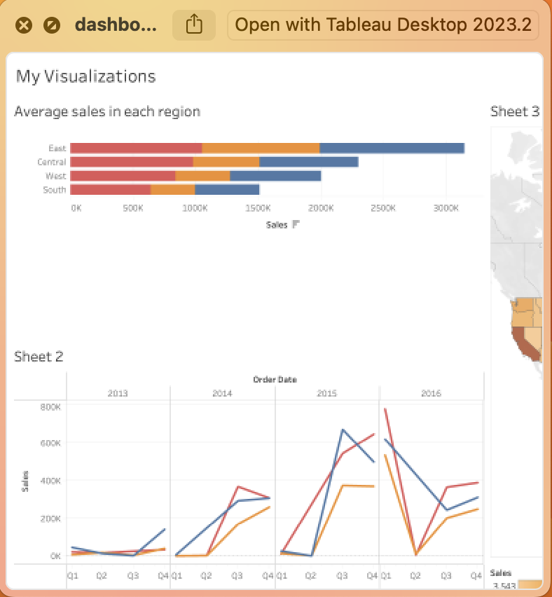
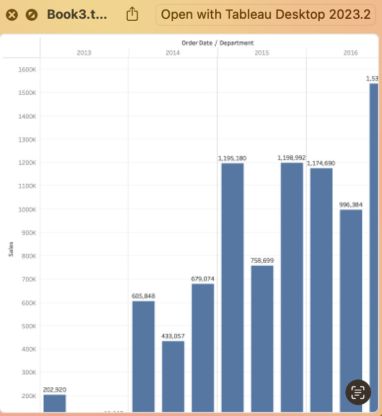

# Capstone

## Tableau Visualizations for Data Analytics (CIDM 6308)

## ERD to match entity's business rules (CIDM 6350)
- [ERD](ERD.pdf)

## Group Predictive Modeling Project (CIDM 6355)
- [Group Project](Group_Project.pdf)

## Wireshark Analysis Report (CIDM 6340)
- [Wireshark Report](Wireshark_Report.pdf)

## Mushroom Models ML Project (CIDM 5310)
- [Mushroom Models](mushroom_models.ipynb)

